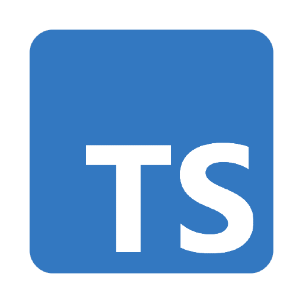

  
  
  
  

# Portfólio | Jhuan Gabriel

🚀 Projeto moderno de portfólio pessoal desenvolvido com **React + Vite**.

## ✨ Preview

  

Veja online: [https://seu-link-deploy.com](https://seu-link-deploy.com)

---

## 🛠️ Tecnologias Utilizadas

- React
- Vite
- Styled-Components
- GSAP (animações)
- Swiper (carrossel)
- Tailwind (configuração)
- Docker (containerização)
- ESLint

---

## 📱 Responsividade

O portfólio é totalmente responsivo, com animações e efeitos adaptados para mobile e desktop.

---

## 🖼️ Estrutura

- `src/components`: Componentes reutilizáveis (cards, loader, header, etc)
- `src/assets`: Imagens, ícones e animações
- `public`: Arquivos estáticos

---

## 💡 Funcionalidades

- Sidebar animada no mobile
- Loader customizado
- Cards de tecnologias com animações
- Formulário de contato estilizado
- Blobs animados no background (desktop)

---

## 👨‍💻 Autor

**Jhuan Gabriel**

- [LinkedIn](https://www.linkedin.com/in/jhuan-gabriel-nascimento-rocha)
- [GitHub](https://github.com/jhuan-gg)

---

  Feito com ❤️ por Jhuan Gabriel

